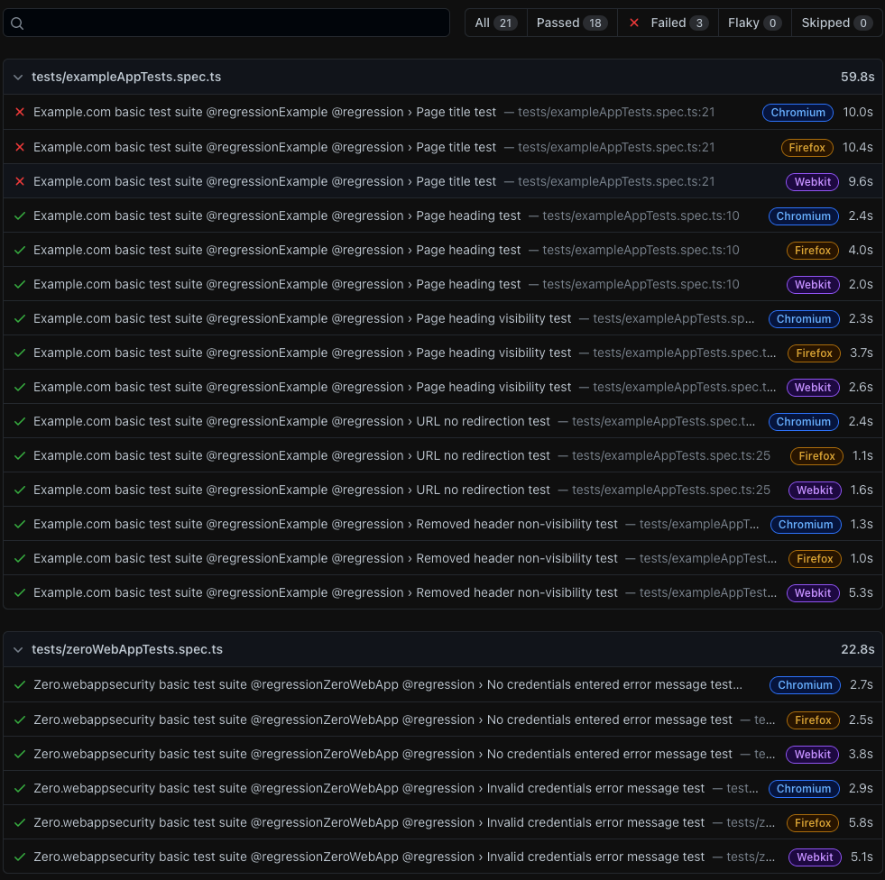

# playwright-typescript-poc

 Language: TypeScript  
 Frameworks: Playwright  
 Dependencies: Prettier

# General Description

Test core repo created to demonstrate the usage of Playwright in action along with TypeScript.

# Installation

1. Clone the repo

SSH: `git@github.com:michalkasiarz/playwright-typescript-poc.git`  
HTTP: `https://github.com/michalkasiarz/playwright-typescript-poc.git`  
Github CLI: `gh repo clone michalkasiarz/playwright-typescript-poc`

2. Install NodeJS and NPM
3. Do a `npm install` in the project root

# Running the tests

There are E2E tests for :link: [ZeroWebApp](http://zero.webappsecurity.com), separated by a given flow, for example payments, searchbox, etc. The following node scripts are defined for running the tests:

`test:e2e` to run all E2E suites for all browsers,

`test:e2e:exchange` to run suite for Exchange Currency flow,

`test:e2e:feedback` for Feedback form,

`test:e2e:funds` for Funds tests,

`test:e2e:login` for login and logout flow,

`test:e2e:payments` for Payments module,

`test:e2e:searchbox` for searchbox,

`test:e2e:transactions` for transactions filtering.

These scripts are being run by NPM, so to start the suite for funds, the complete terminal command looks like `npm run test:e2e:funds`. All tests are set to run concurrently by default and for three browser engines: Chromium, Firefox and Webkit.

In order to customize the run of the tests, `npx playwright test` command needs to be used. To run tests for a specific browser, `--project` parameter needs to be used. For example, to run E2E scenarios for payments flow only on Firefox, use command `npx playwright test --project=firefox --grep @payments`. Headfull mode can be turned on by setting `headless` key to `true` in the `e2e.config.ts` file or by overriding the default setup with the `--headed` parameter for `npx playwright test` command. For details about commands customization refer to :link: [Playwright docs on Command line](https://playwright.dev/docs/intro#command-line).

If there would be any test failures, test run artifacts (videos and screenshots) can be found in the `test-results` catalog. Also, after running the regression set, an HTML test report is generated that will look like this:

The report itself will be placed in the `playwright-report` folder. In order to display the report after the local execution you may need to use `npx playwright show-report` command.

# Playwright Inspector

Playwright provides its own debugger called Playwright Inspector that may be run upon the test execution. In order to use it, add `await page.pause` line at which you want the application to stop. Remember to remove that line after the debugging session!
